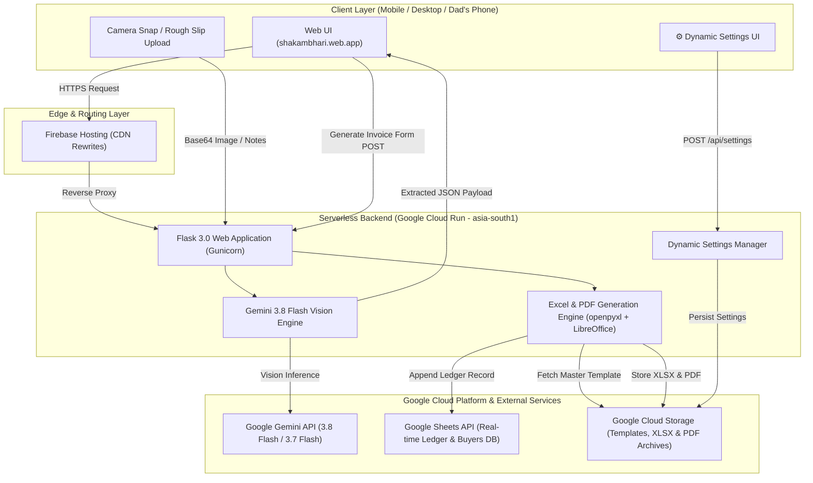

# Shakambhari Bill Generator 🧾✨

[](https://www.python.org/)
[](https://flask.palletsprojects.com/)
[](https://cloud.google.com/run)
[](https://firebase.google.com/)
[](https://aistudio.google.com/)
[](https://developers.google.com/sheets/api)
[-4285F4?logo=googlecloudstorage&logoColor=white)](https://cloud.google.com/storage)
[](https://opensource.org/licenses/MIT)

> **A modern, elderly-friendly automated invoice generation and business management platform.**  
> Originally engineered to solve real-world billing bottlenecks for an aluminium utensils manufacturing business, transitioning paper-based workflows into a high-precision, AI-powered system running seamlessly on mobile, tablet, and desktop.

---

## 🌟 Live Deployment
- **Production Web App:** [https://shakambhari.web.app](https://shakambhari.web.app) *(Powered by Firebase CDN routed to Cloud Run)*
- **Direct Cloud Run URL:** `https://shakambhari-invoices-529104378195.asia-south1.run.app`

---

## 🚀 Key Features

### 📸 Multimodal Vision AI Assistant (Gemini 3.8 Flash)
- **Rough Chit & Slip Scanner:** Dad can take a phone photo (`capture="environment"`) or upload multiple images of handwritten paper chits, weight bridge slips, or transport challans.
- **Smart Entity & Tax Extraction:** Automatically identifies buyer parties, match against database records, parses bag counts, net weights, rates, delivery charges, and GST type.
- **Failover Model Hierarchy:** Powered primarily by **Google Gemini 3.8 Flash Vision**, with automatic fallback across `Gemini 3.7 Flash` $\rightarrow$ `Gemini 3.5 Flash` $\rightarrow$ `Gemini 3.5 Flash-Lite` $\rightarrow$ `Flash-Latest`.
- **Elderly-First Safety Design:** **Autofill Only** — the AI populates form fields on the screen and never generates or commits an invoice automatically. Total manual control remains with the user to review, edit, or append before generating.
- **1-Tap Quick Shortcut Chips:** Tap common preset chips (`Das Metal`, `M/S Manik Store`, `Utensils 2 Bags`, `Gaya Transport`, `Delivery ₹400`) to instantly append instructions without typing.
- **Clipboard Paste Support:** Press `Ctrl + V` anywhere on desktop to immediately open the AI scanner with the pasted screenshot.
- **Visiting Card Scanner:** Instant 1-tap extraction of business cards to create new Buyer Profiles in seconds.

### 📄 Pixel-Perfect Dynamic Document Engine
- **Master Excel Architecture:** Programmatically renders bills using `openpyxl` against a canonical master template (`invoice_template_2026_27.xlsx`).
- **Dynamic Cell Formatting:** Deep-clones borders, fonts, alignments, and formulas across dynamic line items.
- **High-Fidelity PDF Generation:** Headless compilation via LibreOffice / WeasyPrint with embedded digital signatures and formal *"Authorised Signatory"* validation.
- **Automatic E-Waybill Synchronization:** Intelligent linkage where E-Waybill Date automatically tracks Invoice Date when an E-Waybill Number is present, keeping clean empty headers when unassigned.

### 🏛️ Indian GST Compliance Engine
- **Intra-State vs. Inter-State Logic:** Automatically distinguishes between West Bengal local sales (`CGST 9% + SGST 9%`) and inter-state transactions (`IGST 18%` for Bihar, Assam, Jharkhand, etc.).
- **Precise Penny-Rounding:** Implements half-up decimal normalization preventing standard IEEE 754 floating-point rounding anomalies.
- **Automated Currency-to-Words:** Automatically renders full legal amounts in words (e.g., *"Rupees Forty-Three Thousand Seven Hundred Only"*).

### ⚙️ Dynamic Frontend Settings & White-Labeling
- **In-App Configuration UI:** Manage business identity on the fly without touching code or redeploying:
  - Custom Company Name, Subtitle, GSTIN, and State Code
  - Default Item Descriptions & HSN codes (e.g., `76151030`)
  - Default Delivery Charges & Transport Modes
  - Primary AI Model selection & API Key management
  - Numbering format pattern (e.g., `{num}/2026-27`)
- **Cloud-Synced Persistence:** Settings persist locally and sync across Google Cloud Storage (`config/app_settings.json`).

---

## 🏗️ System Architecture



---

## 💻 Quickstart (Run Locally)

### 1. Clone the Repository
```bash
git clone https://github.com/Suvichan2005/Shakambhari-Enterprises-Bill-Generator.git
cd Shakambhari-Enterprises-Bill-Generator
```

### 2. Setup Virtual Environment
```bash
python -m venv .venv

# On Windows:
.venv\Scripts\activate

# On macOS/Linux:
source .venv/bin/activate
```

### 3. Install Dependencies
```bash
pip install -r requirements.txt
```

### 4. Configure Environment
Copy `.env.example` to `.env`:
```bash
cp .env.example .env
```
*(Optional for local testing)* Add your free Gemini API key from [Google AI Studio](https://aistudio.google.com/apikey) into `GEMINI_API_KEY`.

### 5. Start the Local Server
```bash
python app.py
```
Open [http://localhost:5000](http://localhost:5000) in your browser. Default local login: `shakambhari123@`.

---

## 🛠️ White-Label & Customization Guide (For Other Businesses)

If you are cloning this repository to adapt it for your own business or family enterprise, follow these steps:

### 1. Customize via the In-App Settings UI
Click **⚙️ Settings & Defaults** in the top navigation bar:
- **Company Name:** Change to your business name (e.g., `Acme Steel Works`).
- **GSTIN & Address:** Enter your firm's GSTIN and registered dispatch address.
- **Signatory Title:** Change *"Authorised Signatory"* to your custom title or designation.
- **Default Item & HSN:** Set your primary product name and 8-digit HSN code.
- **Numbering Scheme:** Change format string (e.g., `INV-{num}-2026`).

### 2. Customizing the Excel Template
The application uses openpyxl to write directly to predefined coordinates in `cloud/invoice_template_2026_27.xlsx`:

| Cell Coordinate | Field Written | Description |
|---|---|---|
| `A2` | Invoice Number | `INVOICE No. 062/2026-27` |
| `F2` | Invoice Date | `Date : 05/10/2026` |
| `A3` | E-Waybill Number | `Ewaybill No. 123456789012` *(or blank header)* |
| `F3` | E-Waybill Date | `Ewaybill Date : 05/10/2026` *(or blank header)* |
| `F5:F9` | Dispatch / Ship From | Custom warehouse or origin factory address |
| `A13:A18` | Buyer Details | Name, Address, City/PIN, State Code, GSTIN |
| `F13:F18` | Ship To Details | Consignee address *(mirrors buyer)* |
| `A20` | Transport Mode | `Mode of Transport: By Road` |
| `A22:A31` | Item Descriptions | `1. Aluminium Utensils (2 Bags)` |
| `F22:F31` | Item Quantities | Weight in kilograms / units |
| `G22:G31` | Item Rates | Price per unit/kg |
| `H22:H31` | Item HSN Codes | e.g. `76151030` |
| `I22:I31` | Item Amounts | Computed taxable amounts |
| `I32` | Subtotal Amount | Sum of taxable line items |
| `I33` | Delivery Charges | Freight / freight forwarding fee |
| `E34 / I34` | Tax 1 Rate & Amount | CGST 9% (or IGST 18%) |
| `E35 / I35` | Tax 2 Rate & Amount | SGST 9% (if intra-state) |
| `I37` | Round Off | Deviation to nearest whole rupee |
| `I38` | Total Invoice Amount | Final payable amount |
| `A40` | Amount in Words | Legal textual representation |
| `G44` | Company Header | `For Shakambhari Enterprises` |
| `G48` | Signature Footer | `Authorised Signatory` *(sits below image)* |

You can modify fonts, logos, watermarks, or color themes directly in Excel while preserving these coordinate cells!

### 3. Gemini Vision AI Setup
- **Free Tier (Zero Cost):** Get a free API key at [Google AI Studio](https://aistudio.google.com/apikey). Provides 15 Requests Per Minute (RPM) and 1,500 Requests Per Day, which is more than sufficient for small businesses.
- **Paid Tier (Pay-As-You-Go):** For high-volume factories requiring unlimited RPM, enable billing in AI Studio or GCP. At ~$0.0001 per invoice scan, processing 1,000 invoices costs less than $0.10 (₹8).
- **Backend Setup:** Set `GEMINI_API_KEY="your-key"` in Cloud Run or your `.env` file so mobile users never need to configure keys manually.

---

## 🌐 Cloud Deployment (Google Cloud Run + Firebase Hosting)

### Step 1: Deploy Backend to Google Cloud Run
From the root directory:
```powershell
gcloud run deploy shakambhari-invoices `
    --source cloud `
    --region asia-south1 `
    --platform managed `
    --allow-unauthenticated `
    --service-account shakambhari-app@shakambhari.iam.gserviceaccount.com `
    --set-env-vars "GOOGLE_CLOUD_PROJECT=shakambhari,SPREADSHEET_ID=your_sheet_id,GCS_BUCKET_NAME=your_bucket_name,APP_PASSWORD=your_password,FLASK_ENV=production,SESSION_COOKIE_SECURE=true,GEMINI_API_KEY=your_key"
```

### Step 2: Connect Custom Domain via Firebase Hosting
Link your Cloud Run service to Firebase Hosting for clean CDN caching and a branded `.web.app` URL:
```bash
firebase deploy --only hosting --project shakambhari
```
`firebase.json` automatically routes all requests to Cloud Run in `asia-south1`:
```json
{
  "hosting": {
    "public": "public",
    "rewrites": [
      {
        "source": "**",
        "run": {
          "serviceId": "shakambhari-invoices",
          "region": "asia-south1"
        }
      }
    ]
  }
}
```

---

## 📁 Repository Structure

```
├── app.py                       # Local Flask application entry point
├── config.py                    # Local path resolution & environment defaults
├── settings_manager.py          # Dynamic business settings engine (local & GCS sync)
├── buyer_profiles.json          # Seed buyer profiles directory
├── transport_modes.json         # Seed transport carriers catalog
├── firebase.json                # Firebase Hosting CDN rewrite specification
├── .firebaserc                  # Firebase project linkage
├── cloud/                       # Cloud Run deployment package
│   ├── app_cloud.py             # Cloud Flask backend with Gemini 3.8 Vision & DB engines
│   ├── cloud_storage.py         # Google Cloud Storage interface (PDF/XLSX/Templates)
│   ├── sheets_db.py             # Google Sheets API ledger database driver
│   ├── settings_manager.py      # Cloud settings manager (with GCS bucket synchronization)
│   ├── app_settings.json        # Persistent settings definition
│   ├── Dockerfile               # Production container (Python 3.11 + LibreOffice Calc)
│   ├── deploy_cloudrun.ps1      # Automated Cloud Run deployment script
│   └── invoice_template_2026_27.xlsx # Master Excel invoice template
├── templates/                   # Frontend HTML5 UI (Jinja2)
│   ├── index.html               # Main invoicing screen, Gemini AI modal & Settings modal
│   ├── success.html             # Download screen (PDF / XLSX 1-click actions)
│   ├── profile_form.html        # Buyer profile form with visiting card scanner
│   └── list_profiles.html       # Manage buyer directory
└── requirements.txt             # Core Python package dependencies
```

---

## 🛡️ Security & Privacy
- **Stateless Authentication:** All routes are protected by session authentication with HTTP-only, secure cookies.
- **Zero-Storage of API Keys on Client:** Cloud Run securely stores the Gemini key in environment variables, preventing client exposure.
- **Private GCP Bucket:** Generated invoices and ledger databases are stored with private IAM access; files are fetched via authenticated server proxies.
- **No Unintended Commits:** Credentials, `.env` files, temporary XLSX outputs, and service account keys are strictly excluded via `.gitignore`.

---

## 📜 License
Distributed under the **MIT License**. See `LICENSE` for more information. Built with ❤️ for family business empowerment.
