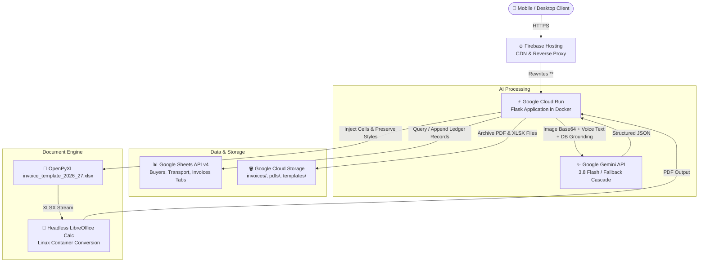

# Shakambhari Bill Generator & Invoicing Automation

[](https://www.python.org/)
[](https://flask.palletsprojects.com/)
[](https://cloud.google.com/run)
[](https://firebase.google.com/)
[](https://aistudio.google.com/)
[](https://developers.google.com/sheets/api)
[](https://web.dev/progressive-web-apps/)
[](https://opensource.org/licenses/MIT)

A full-stack invoicing automation system and Progressive Web App (PWA) that converts handwritten trade chits, weighbridge scale slips, voice notes, and manual inputs into Indian GST-compliant tax invoices. Built for an active wholesale metal manufacturing and trading firm in West Bengal, and deployed in production on Google Cloud Run and Firebase Hosting.

---

## 1. Project Overview

In wholesale manufacturing and physical commodity distribution across India, trade orders rarely begin inside ERP software. Instead, day-to-day transactions originate as handwritten paper chits, weighbridge weight slips, or voice messages dictating bag counts and rates.

Transforming these informal records into official, GST-compliant tax invoices typically requires manual transcription into desktop spreadsheet software. This process introduces arithmetic errors, tax classification mistakes, and delays, while remaining largely inaccessible on mobile devices in warehouse environments.

**Shakambhari Bill Generator** solves this end-to-end. Users can photograph paper chits, dictate instructions using voice, or select from an indexed buyer directory. The system extracts and grounds the information using Google's Gemini Vision API against known ledger data, enforces Indian GST tax and rounding rules, generates pixel-perfect `.xlsx` spreadsheets and `.pdf` documents via headless LibreOffice Calc, and synchronizes records across Google Sheets and Google Cloud Storage.

---

## 2. Problem & Solution

| Operational Problem | Engineering Solution |
|---------------------|----------------------|
| **Unstructured Ingestion:** Orders scribbled on informal paper slips (e.g., *"Das Metal 2 bags utensils 89.080 kg @ 400 Gaya transport delivery 400"*). | Multimodal vision extraction powered by Google Gemini with runtime database grounding (buyer profiles, carrier names, used bill numbers). |
| **Warehouse Accessibility:** Desktop spreadsheet software is impractical to use while weighing goods at godowns and loading trucks. | Mobile-optimized Progressive Web App (PWA) with responsive layouts, touch controls, and offline static asset caching. |
| **Tax & Rounding Errors:** Manual computation of Intra-State (CGST+SGST) vs Inter-State (IGST), freight inclusion, and rupee rounding. | Automated GST rules engine: detects buyer state codes, applies correct tax splits, and rounds totals via `ROUND_HALF_UP` arithmetic. |
| **Database Overhead:** Traditional relational databases require ongoing administration, hosting costs, and custom reporting UIs. | Google Sheets API v4 as the primary tabular transaction ledger, giving non-technical stakeholders and accountants immediate visibility. |
| **Document Fidelity:** Plain HTML-to-PDF converters distort cell alignments and print borders required for physical tax invoices. | Master Excel template injection via `openpyxl` paired with headless LibreOffice Calc for 1-to-1 visual parity between `.xlsx` and `.pdf`. |

---

## 3. How It Works

1. **Ingestion:** The user captures or uploads one or more slip photos, pastes clipboard images, or dictates instructions via the Web Speech API microphone input.
2. **AI Extraction & Grounding:** A backend REST pipeline passes the input to the Gemini Vision API along with active business context (known buyers, transport carriers, dispatch addresses, and sequential invoice history). Gemini extracts structured JSON while matching known entities and checking for duplicate bill numbers.
3. **Human-in-the-Loop Review:** Extracted data populates an 8-step linear form. A strict architectural constraint ensures the system **never auto-commits or generates an invoice without manual user verification**.
4. **Validation & Calculation:** Real-time client and server logic computes line subtotals, freight charges, GST amounts, half-up round-off values, and Indian currency words representation.
5. **Document Rendering:** On submission, the backend populates values into a pre-styled master Excel template (`invoice_template_2026_27.xlsx`) using `openpyxl` and converts it to a printable PDF using headless LibreOffice.
6. **Dual Archival:** The invoice record is appended to the Google Sheets transaction database, while generated `.xlsx` and `.pdf` binaries are archived in a Google Cloud Storage bucket.

---

## 4. Key Features

- **Multimodal Slip Ingestion:** Accepts multiple image files (JPEG, PNG, WEBP), camera captures, and direct desktop clipboard image pasting (`Ctrl + V`).
- **Bilingual Voice Input:** Browser-level microphone integration via the Web Speech API configured for Hindi and English (`hi-IN`), transcribing spoken instructions into the assistant prompt.
- **Context-Grounded Extraction:** Injects known buyer profiles (GSTIN, addresses, state codes), registered transport carriers, and past invoice numbers directly into the Gemini prompt for high entity-matching accuracy.
- **Model Failover Cascade:** Uses `gemini-3.8-flash` primarily, with automated failover through `gemini-3.7-flash`, `gemini-3.5-flash`, `gemini-3.5-flash-lite`, and `gemini-flash-latest` upon encountering rate limits (HTTP 429) or temporary server load (HTTP 503).
- **Multi-Turn Revision Support:** Retains working draft state and chat history so users can refine extraction through follow-up prompts (e.g., *"change rate to 410"*, *"add delivery charge 300"*).
- **Sequential Number Tracking:** Automatically queries Google Sheets and GCS to recommend the next sequential invoice number for the active financial year (e.g., `62/2026-27`), warning if an entered number already exists.
- **Accurate GST Tax Engine:** Auto-identifies Intra-State transactions (West Bengal state code `19` $\rightarrow$ CGST 6% + SGST 6%) versus Inter-State transactions (IGST 12%), correctly applying tax over goods plus freight.
- **Precise Decimal Rounding:** Uses commercial half-up rounding (`ROUND_HALF_UP`) to compute exact round-off amounts to the nearest whole integer rupee, with backend amount-to-words generation (`num2words`).
- **Dual Document Generation:** Produces downloadable, formula-preserving `.xlsx` workbooks and print-ready `.pdf` files rendered via headless LibreOffice Calc with Croscore fonts.
- **Dual-Tier Storage Architecture:** Transaction metadata is appended to Google Sheets for immediate access by non-technical accountants, while binary files are permanently archived in Google Cloud Storage.
- **Installable Progressive Web App (PWA):** Service worker and Web App Manifest enable 1-tap installation on Android and iOS devices, providing full-screen execution without browser navigation bars.
- **Past Invoices Management:** Allows searching, viewing, and loading historical invoices back into the form with tolerant identifier matching (`61`, `061`, `61/2026-27`) for editing or reissuing.
- **Dynamic In-App Settings:** Built-in settings modal (`⚙️`) allows updating business legal entity details, GSTIN, default warehouse addresses, invoice numbering formats, and Gemini model selections without editing source code or redeploying.

---

## 5. End-to-End Workflow

```
[Physical Slip / Voice Note]
             │
             ▼
[Assistant Modal / Camera / Mic]
             │
             ▼
[POST /api/ai/parse-bill]
   ├── Retrieve context: Known Buyers, Transporters, Used Invoice IDs from Google Sheets
   ├── Execute Gemini Multimodal API with fallback cascade
   └── Return structured JSON payload
             │
             ▼
[Human Verification in Form]
   ├── Step 1: Invoice Number & Date
   ├── Step 2: Warehouse Dispatch Origin
   ├── Step 3: E-Waybill Number & Date (Optional)
   ├── Step 4: Transport Mode / Carrier
   ├── Step 5: Buyer Directory Search & Auto-fill
   ├── Step 6: Alternate Consignee / Delivery Address (Optional)
   ├── Step 7: Dynamic Line Items (Description, Bags, HSN, Weight, Rate)
   └── Step 8: Live Preview Slip Inspection & Manual "Generate" Trigger
             │
             ▼
[POST /generate_invoice]
   ├── Server-side validation of fields and calculations
   ├── openpyxl: Cell injection into master template (invoice_template_2026_27.xlsx)
   ├── LibreOffice: Headless conversion from .xlsx to .pdf
   ├── Google Sheets API: Append record to "Invoices" worksheet
   └── Google Cloud Storage: Upload .xlsx and .pdf to bucket
             │
             ▼
[Success Screen: Download PDF & Excel / View Past Bills]
```

---

## 6. Architecture & Data Flow



---

## 7. AI, Vision & Document Processing

The vision extraction pipeline is implemented in [`cloud/app_cloud.py`](cloud/app_cloud.py) under `POST /api/ai/parse-bill`:

- **Direct HTTP Execution:** Communicates directly with `https://generativelanguage.googleapis.com/v1beta/models/{model}:generateContent` using Python's standard `urllib.request`, avoiding heavy external SDK dependencies and reducing cold start times.
- **Runtime Grounding:** Before sending the request to Gemini, the endpoint queries the Google Sheets database to inject:
  - Complete buyer profile summary (names, GSTINs, states, profile IDs).
  - List of known transport carriers.
  - List of known warehouse dispatch addresses.
  - Recent invoice numbers to detect duplicates.
  - Suggested next sequential invoice number.
- **Deterministic JSON Mode:** Configured with `temperature: 0.1` and `responseMimeType: "application/json"` to ensure structured, machine-parsable responses.
- **Model Hierarchy & Automated Failover:**
  1. Primary model: `gemini-3.8-flash` (or configured preference from Settings).
  2. Backup models: `gemini-3.7-flash`, `gemini-3.5-flash`, `gemini-3.5-flash-lite`, `gemini-flash-latest`.
  3. If an HTTP 429 (quota/rate limit) or HTTP 503 (server load) error is returned, the request automatically cascades to the next model in sequence.
- **Human-in-the-Loop Principle:** Extracted data is transmitted back to the browser only to pre-fill form fields. The system prohibits autonomous commits; a human must review all numbers and manually initiate document generation.

---

## 8. Data Storage & Ledger Archival

### Google Sheets Database Schema
Managed via [`cloud/sheets_db.py`](cloud/sheets_db.py) using the `gspread` library:
- **`Buyers` Tab:** `profile_id`, `buyer_name`, `buyer_details` (JSON array of address lines), `gstin`, `default_tax_type`, `created_at`, `updated_at`.
- **`Transport` Tab:** `mode` (carrier name), `created_at`.
- **`Invoices` Tab:** Complete tabular transaction log containing `invoice_number`, `invoice_date`, `ewaybill_number`, `ewaybill_date`, `buyer_name`, `buyer_details`, `buyer_gstin`, `ship_from_details`, `ship_to_details`, `transport_mode`, `items_json`, `subtotal`, `tax_type`, `display_tax_type`, `tax_rate_igst`, `tax_rate_cgst`, `tax_rate_sgst`, `tax_amount`, `total_amount`, and timestamp.
- **Caching:** Includes a 60-second in-memory TTL cache for buyer profiles and transport modes to prevent hitting Google Sheets API read rate limits.

### Google Cloud Storage (GCS)
Managed via [`cloud/cloud_storage.py`](cloud/cloud_storage.py):
- `invoices/`: Stores generated `.xlsx` spreadsheets named `Invoice_{number}_{buyer}.xlsx`.
- `pdfs/`: Stores generated `.pdf` documents.
- `templates/`: Stores master template backups.
- `config/`: Stores persisted `app_settings.json` business configurations.
- Supports pre-signed download URLs (`generate_signed_url`) with configurable validity periods.

---

## 9. Technology Stack

### Backend
- **Python 3.11:** Primary backend runtime.
- **Flask 3.0 / 3.1:** Lightweight WSGI web framework providing REST APIs and server-rendered views.
- **Gunicorn 21.2:** Production WSGI HTTP server running in containerized environments.
- **openpyxl 3.1:** Excel manipulation library used to read, populate, and format XLSX workbooks.
- **num2words 0.5:** Converts numerical currency totals into words according to Indian naming conventions.
- **gspread 6.0 & google-auth:** Client library interface for Google Sheets API v4.
- **google-cloud-storage 2.14:** Official client library for Google Cloud Storage.

### Frontend
- **Vanilla JavaScript (ES6+):** Lightweight reactive client logic with zero third-party framework overhead.
- **HTML5 & Modern CSS3:** Custom responsive layout with CSS variables, CSS grid/flexbox, and mobile-first docking.
- **Web Speech API:** In-browser speech-to-text recognition configured for bilingual Hindi/English (`hi-IN`).
- **Progressive Web App (PWA):** Service Worker (`sw.js`) and Web App Manifest (`manifest.json`) for standalone mobile installation.

### Cloud Infrastructure
- **Google Cloud Run:** Serverless container platform with automatic scaling (scale-to-zero when idle) deployed in `asia-south1` (Mumbai).
- **Firebase Hosting:** Global CDN reverse proxy routing incoming traffic to Cloud Run with automatic SSL.
- **LibreOffice Calc (Headless):** Installed inside the Linux container image to render pixel-accurate PDF invoices from generated XLSX files.
- **Google Cloud IAM:** Dedicated service account credentials with least-privilege scoping to Sheets and GCS.

---

## 10. Project Structure

```
.
├── .env.example                     # Environment variable template
├── .firebaserc                      # Firebase project binding
├── .gitignore                       # Git ignore rules (protects credentials and signatures)
├── README.md                        # Project documentation
├── app.py                           # Local development Flask entry point
├── config.py                        # Application configuration constants
├── firebase.json                    # Firebase Hosting rewrite rules to Cloud Run
├── requirements.txt                 # Local Python dependencies
├── run_local.bat                    # Windows batch launcher for local testing
├── sample_invoice_template.xlsx     # Sanitized reference Excel template
├── settings_manager.py              # Dynamic configuration manager (local fallback)
│
├── cloud/                           # Cloud Run deployment package
│   ├── .dockerignore                # Docker build exclusions
│   ├── .env.example                 # Cloud environment configuration template
│   ├── .gcloudignore                # Google Cloud CLI deployment exclusions
│   ├── .gitignore                   # Cloud package git exclusions
│   ├── DEPLOYMENT_GUIDE.md          # Internal cloud setup reference
│   ├── Dockerfile                   # Python 3.11-slim + LibreOffice Calc container definition
│   ├── app.yaml                     # App Engine compatibility configuration
│   ├── app_cloud.py                 # Production Flask application for Cloud Run
│   ├── cloud_storage.py             # Google Cloud Storage integration client
│   ├── deploy_cloudrun.ps1          # Automated deployment PowerShell script
│   ├── migrate_data.py              # Data migration utility from local JSON to Cloud
│   ├── preflight_check.py           # Pre-deployment validation test suite
│   ├── requirements.txt             # Production container Python dependencies
│   ├── settings_manager.py          # Dynamic configuration manager with GCS persistence
│   ├── sheets_db.py                 # Google Sheets API ledger database client
│   ├── static/                      # Static assets for container (icons, PWA files)
│   └── templates/                   # Jinja2 HTML templates for cloud deployment
│
├── public/                          # Static public directory for Firebase Hosting CDN
│   ├── favicon.ico
│   ├── icon-192.png
│   ├── icon-512.png
│   ├── manifest.json
│   └── sw.js
│
├── scripts/
│   └── deploy_cloud_run.sh          # Shell script for container build and deployment
│
├── static/                          # Local static assets
│   ├── favicon.ico
│   ├── icon-192.png
│   ├── icon-512.png
│   ├── manifest.json
│   └── sw.js
│
├── templates/                       # Local HTML templates
│   ├── error.html                   # HTTP error page
│   ├── index.html                   # Main invoicing form, AI assistant, and settings modal
│   ├── invoice_pdf_template.html    # Standalone HTML invoice view
│   ├── list_profiles.html           # Buyer profiles directory view
│   ├── login.html                   # Session authentication view
│   ├── profile_form.html            # Buyer profile editor view
│   └── success.html                 # Post-generation download view
│
└── tests/
    └── test_preview.py              # Unit tests for calculations, rounding, and numbering
```

---

## 11. Configuration & Environment Variables

Create a `.env` file in the project root or configure the variables in Cloud Run:

| Variable | Required | Description |
|----------|----------|-------------|
| `GOOGLE_CLOUD_PROJECT` | Yes (Cloud) | Google Cloud Project ID (e.g., `shakambhari`). |
| `GCS_BUCKET_NAME` | Yes (Cloud) | Google Cloud Storage bucket name for storing `.xlsx`, `.pdf`, and configs. |
| `SPREADSHEET_ID` | Yes (Cloud) | Google Spreadsheet ID extracted from the spreadsheet URL. |
| `APP_PASSWORD` | Yes | Password required to log in to the web interface. |
| `GEMINI_API_KEY` | Optional | Google Gemini API key (free tier supported from Google AI Studio). |
| `FLASK_SECRET_KEY` | Yes | Cryptographic secret key for signing session cookies. |
| `GOOGLE_APPLICATION_CREDENTIALS` | Local only | Path to service account JSON key file (handled via IAM in Cloud Run). |
| `FLASK_ENV` | Optional | Set to `production` or `development`. |
| `SESSION_COOKIE_SECURE` | Optional | Set to `true` to require HTTPS for session cookies. |
| `PORT` | Optional | Web server bind port (defaults to `8080` in container, `5000` locally). |

---

## 12. Local Development Setup

### Prerequisites
- Python 3.11 or higher
- Git

### Installation Steps

1. **Clone the repository:**
   ```bash
   git clone https://github.com/Suvichan2005/Shakambhari-Invoice-Automation.git
   cd Shakambhari-Invoice-Automation
   ```

2. **Create and activate a virtual environment:**
   ```bash
   python -m venv .venv

   # On Windows:
   .venv\Scripts\activate

   # On macOS / Linux:
   source .venv/bin/activate
   ```

3. **Install dependencies:**
   ```bash
   pip install -r requirements.txt
   ```

4. **Configure environment variables:**
   ```bash
   cp .env.example .env
   ```
   Edit `.env` and set your `APP_PASSWORD` and `GEMINI_API_KEY`.

5. **Launch the local development server:**
   ```bash
   python app.py
   ```
   Open [http://localhost:5000](http://localhost:5000) in your browser and log in with your configured `APP_PASSWORD`.

---

## 13. Deployment

The application is deployed across **Google Cloud Run** (compute & document engine) and **Firebase Hosting** (global CDN reverse proxy).

### 1. Preflight Verification
Before deploying, execute the automated preflight check:
```powershell
python cloud/preflight_check.py
```

### 2. Cloud Run Deployment
Deploy the container from the `cloud/` directory:
```powershell
gcloud run deploy shakambhari-invoices `
    --source cloud `
    --region asia-south1 `
    --platform managed `
    --allow-unauthenticated `
    --service-account shakambhari-app@shakambhari.iam.gserviceaccount.com `
    --set-env-vars "GOOGLE_CLOUD_PROJECT=shakambhari,SPREADSHEET_ID=your_spreadsheet_id,GCS_BUCKET_NAME=your_bucket_name,APP_PASSWORD=your_password,FLASK_ENV=production,SESSION_COOKIE_SECURE=true,GEMINI_API_KEY=your_key"
```

### 3. Firebase Hosting CDN Rewrites
Deploy Firebase Hosting rules to route incoming traffic from the custom `.web.app` domain to Cloud Run:
```bash
firebase deploy --only hosting --project shakambhari
```

---

## 14. Security & Reliability

- **Session Security:** Authenticated user sessions are stored in encrypted cookies configured with `HttpOnly`, `SameSite=Lax`, and `Secure` attributes.
- **Open Redirect Protection:** Post-login redirection targets are validated and normalized to internal GET routes, preventing open redirect exploits.
- **Sliding-Window Rate Limiting:** In-memory request throttling monitors inbound IP addresses (`X-Forwarded-For` aware) across sensitive endpoints (`/login`, `/api/ai/parse-bill`) to mitigate automated scraping and abuse spikes.
- **IAM Least Privilege:** In production, Cloud Run uses an IAM service account scoped exclusively to the specific Google Sheet and GCS bucket, eliminating the need to store static JSON credentials inside the container.
- **Secret Scrubbing:** All personal signatures, credentials, and API keys are strictly excluded from version control via `.gitignore`.
- **Fault-Tolerant Retrieval:** If an invoice record cannot be resolved from Google Sheets, the backend transparently searches GCS blob storage, parsing stored Excel files to reconstruct the data.

---

## 15. Verification & Testing

The repository includes automated checks:
- **Unit Test Suite (`tests/test_preview.py`):** Tests arithmetic calculations for IGST and CGST+SGST, freight addition, half-up rounding accuracy, and financial year sequential number isolation.
- **Preflight Check (`cloud/preflight_check.py`):** Validates the existence of required cloud assets, Dockerfile prerequisites, `.gitignore` rules, and template bindings before container compilation.

To run arithmetic calculation tests:
```bash
python -m unittest tests/test_preview.py
```

---

## 16. Live Application

The production application is live and operational:
- **Production URL:** [https://shakambhari.web.app](https://shakambhari.web.app)
- **Direct Cloud Run Service:** `https://shakambhari-invoices-529104378195.asia-south1.run.app`
- **Hosting Region:** `asia-south1` (Mumbai, India)

---

## 17. License

This project is released under the [MIT License](LICENSE).
