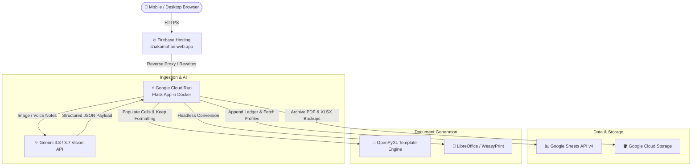

# Shakambhari Bill Generator 🧾

[](https://www.python.org/)
[](https://flask.palletsprojects.com/)
[](https://cloud.google.com/run)
[](https://firebase.google.com/)
[](https://aistudio.google.com/)
[](https://developers.google.com/sheets/api)
[](https://web.dev/progressive-web-apps/)
[](https://opensource.org/licenses/MIT)

A web application that automates Indian GST tax invoice generation from handwritten paper chits, weight-scale slips, and voice notes. Built for a family wholesale metal manufacturing and trading business, and deployed on Google Cloud Run and Firebase Hosting.

---

## 🔗 Live Links
- **Production Web App (PWA):** [https://shakambhari.web.app](https://shakambhari.web.app)
- **Direct Cloud Run Endpoint:** `https://shakambhari-invoices-529104378195.asia-south1.run.app`

---

## 💡 Background & Motivation

In small wholesale manufacturing businesses in India (like our family's aluminium utensil trading firm in Howrah/Kolkata), transactions don't start in an ERP system. They start as scribbled handwriting on paper slips, weighbridge chits, or WhatsApp text notes—for example:
> *"Das Metal 2 bags utensils 89.080 kg @ 400 Gaya transport delivery 400"*

Previously, turning these slips into GST-compliant tax invoices meant manual data entry into Excel on a desktop computer. This was slow, prone to arithmetic errors, and difficult to do on a mobile phone while working at the warehouse or godown.

I built this application to solve that problem. A user can snap a photo of a rough paper slip or speak into the microphone. The application parses the details using Gemini Vision, populates the invoice form, lets the user review and edit the fields, and produces a printable PDF and Excel invoice in a couple of seconds.

---

## 🛠️ Key Design Choices & Trade-offs

### 1. Google Sheets as the Primary Ledger Database
Instead of running a dedicated PostgreSQL or MySQL instance, invoice records and buyer directories are stored directly in a Google Sheet via the Google Sheets API:
- **Zero maintenance & \$0 cost:** No database server to monitor or manage.
- **Accessible to non-technical users:** My family members and our accountant can view, search, export, and audit invoice history directly using the Google Sheets mobile app without needing a custom admin dashboard or SQL access.
- **Disaster recovery backup:** Every generated invoice file (both `.xlsx` and `.pdf`) is also automatically archived to a private Google Cloud Storage (GCS) bucket.

### 2. Serverless Cloud Hosting (Cloud Run + Firebase Hosting)
- **Docker container on Cloud Run:** Scales down to zero instances when not in use, keeping hosting costs within GCP's free tier.
- **Firebase Hosting as Reverse Proxy:** Provides clean CDN caching and a branded `.web.app` domain pointing to the Cloud Run container in the `asia-south1` (Mumbai) region.

### 3. Human-in-the-Loop AI (Form-Fill Only, Never Auto-Commit)
Handwritten Indian trade chits often contain abbreviations and informal phrasing. While Gemini Vision extracts parties, weights, and rates with high accuracy, the system has a strict architectural rule:
- The AI **only pre-fills the input fields** on the screen.
- It **never automatically generates, saves, or finalizes a bill**.
- A human must review the extracted numbers, adjust rates or weights if needed, and click "Generate Invoice" manually.

### 4. Progressive Web App (PWA) Support
Instead of maintaining a separate Android native app, the web app includes a Web App Manifest (`manifest.json`) and a Service Worker (`sw.js`). When opened in mobile Chrome, it can be installed to the phone's home screen with 1 tap, running in standalone full-screen mode without browser address bars.

### 5. Template Formatting Engine
Rather than creating spreadsheets from scratch in Python, the backend uses `openpyxl` to write values into a predefined master template (`invoice_template_2026_27.xlsx`). This preserves cell borders, formulas, alignments, and print margins needed for physical GST invoices, followed by headless PDF generation.

---

## 🏗️ System Architecture



---

## 🌟 Core Features

- **Multimodal Slip Ingestion:** Upload or take a picture of paper slips, weight chits, or visiting cards. Clipboard paste (`Ctrl + V`) is supported on desktop.
- **Voice Input:** Built-in microphone button using the Web Speech API to dictate order instructions in English/Hindi.
- **Fallback AI Cascade:** Uses `gemini-3.8-flash` primarily, with automatic fallback to `gemini-3.7-flash` or `gemini-3.5-flash` if rate limits occur.
- **GST Calculations:** Automatic calculation of taxable value, IGST (inter-state 12%) vs CGST+SGST (intra-state 6% + 6%), delivery charges, and round-off to the nearest rupee.
- **Sequential Numbering:** Tracks existing invoices in Google Sheets and GCS to suggest the next sequential invoice number for the active financial year (e.g. `62/2026-27`).
- **E-Waybill Support:** Optional E-waybill number and date fields, with auto-sync to invoice date.
- **Dispatch Warehouse Flexibility:** Alternate dispatch address selection (e.g., warehouse in Belur vs registered office in Strand Road).
- **Buyer Directory:** Auto-complete search across saved buyers with 1-click loading of GSTIN, address, and state code.
- **Dynamic Settings UI:** In-app modal (`⚙️`) to update business name, address, GSTIN, default HSN, default delivery charges, and AI preferences without touching code.

---

## 💻 Running Locally

### Prerequisites
- Python 3.11 or higher
- (Optional) A free Google Gemini API key from [Google AI Studio](https://aistudio.google.com/apikey)

### Steps

1. **Clone the repository:**
   ```bash
   git clone https://github.com/Suvichan2005/Shakambhari-Enterprises-Bill-Generator.git
   cd Shakambhari-Enterprises-Bill-Generator
   ```

2. **Create and activate a virtual environment:**
   ```bash
   python -m venv .venv

   # On Windows:
   .venv\Scripts\activate

   # On Linux/macOS:
   source .venv/bin/activate
   ```

3. **Install dependencies:**
   ```bash
   pip install -r requirements.txt
   ```

4. **Set environment variables:**
   Copy `.env.example` to `.env`:
   ```bash
   cp .env.example .env
   ```
   Add your `GEMINI_API_KEY` in `.env` if you want to test the slip scanner locally.

5. **Run the application:**
   ```bash
   python app.py
   ```
   Open [http://localhost:5000](http://localhost:5000) in your browser. Log in with the `APP_PASSWORD` configured in your `.env`.

---

## ⚙️ Adapting for Your Own Business (White-Labeling)

If you are cloning this project for another firm:

1. **Via the Web Interface:**
   - Log in and click the **⚙️ Settings** icon in the top navigation bar.
   - Update the **Company Legal Name**, **GSTIN**, **Registered Office Address**, **Default Warehouse Address**, and **Invoice Number Format**.
   - Changes are saved to `app_settings.json` locally and synced to GCS in cloud deployments.

2. **Excel Template Customization:**
   - The master template is stored at `cloud/invoice_template_2026_27.xlsx`.
   - The code writes to standard cell coordinates:
     - `A2`: Invoice Number
     - `F2`: Invoice Date
     - `A3` & `F3`: E-Waybill Number & Date
     - `F5:F9`: Dispatch Origin Address
     - `A13:A18`: Buyer Details (Name, Address, GSTIN)
     - `F13:F18`: Ship To Details
     - `A20`: Transport Mode
     - `A22:I31`: Line Items (Description, Quantity, Rate, HSN, Taxable Amount)
     - `I33`: Delivery Charges
     - `E34/I34` & `E35/I35`: GST Rates and Tax Amounts
     - `I37`: Round Off
     - `I38`: Invoice Total
     - `A40`: Amount in Words
   - You can update company logos, fonts, or borders in Excel as long as the cell coordinates remain consistent.

---

## ☁️ Deployment

### 1. Google Cloud Run
Build and deploy the container directly from the `cloud/` directory:
```powershell
gcloud run deploy shakambhari-invoices `
    --source cloud `
    --region asia-south1 `
    --platform managed `
    --allow-unauthenticated `
    --service-account shakambhari-app@shakambhari.iam.gserviceaccount.com `
    --set-env-vars "GOOGLE_CLOUD_PROJECT=shakambhari,SPREADSHEET_ID=your_sheet_id,GCS_BUCKET_NAME=your_bucket_name,APP_PASSWORD=your_password,FLASK_ENV=production,SESSION_COOKIE_SECURE=true,GEMINI_API_KEY=your_key"
```

### 2. Firebase Hosting CDN
Deploy hosting rewrites to connect `shakambhari.web.app` to Cloud Run:
```bash
firebase deploy --only hosting --project shakambhari
```

---

## 📁 Project Structure

```
├── app.py                       # Local Flask application
├── settings_manager.py          # Dynamic configuration manager (local & GCS)
├── buyer_profiles.json          # Seed buyer records
├── transport_modes.json         # Seed transport carrier records
├── firebase.json                # Firebase Hosting rewrite configuration
├── .firebaserc                  # Firebase project configuration
├── static/                      # Static assets, icons, manifest, service worker
│   ├── manifest.json            # PWA Web App Manifest
│   ├── sw.js                    # PWA Service Worker
│   ├── icon-192.png             # PWA app icons (192x192 & 512x512)
│   └── favicon.ico              # Favicon
├── templates/                   # HTML5 Jinja2 templates
│   ├── index.html               # Main invoicing form, AI assistant & Settings UI
│   ├── success.html             # Download screen (PDF / XLSX)
│   ├── profile_form.html        # Buyer profile creation form
│   └── list_profiles.html       # Buyer directory view
├── cloud/                       # Cloud Run deployment package
│   ├── app_cloud.py             # Cloud Flask backend
│   ├── sheets_db.py             # Google Sheets API ledger driver
│   ├── cloud_storage.py         # Google Cloud Storage driver
│   ├── Dockerfile               # Container build (Python 3.11 + LibreOffice)
│   ├── deploy_cloudrun.ps1      # Automated deployment script
│   └── invoice_template_2026_27.xlsx # Master Excel invoice template
└── public/                      # Static public folder for Firebase CDN hosting
```

---

## 🔒 Security Practices

- **Push Protection & Secret Scrubbing:** No API keys, passwords, or service account JSON files are committed to version control.
- **Session Authentication:** Protected by server-side session cookies with `Secure`, `HttpOnly`, and `SameSite` flags.
- **Scoped IAM Credentials:** Cloud Run uses a dedicated Google Cloud service account with minimal IAM permissions limited to the specific Google Sheet and GCS bucket.

---

## 📄 License
This project is open-source under the [MIT License](LICENSE).
